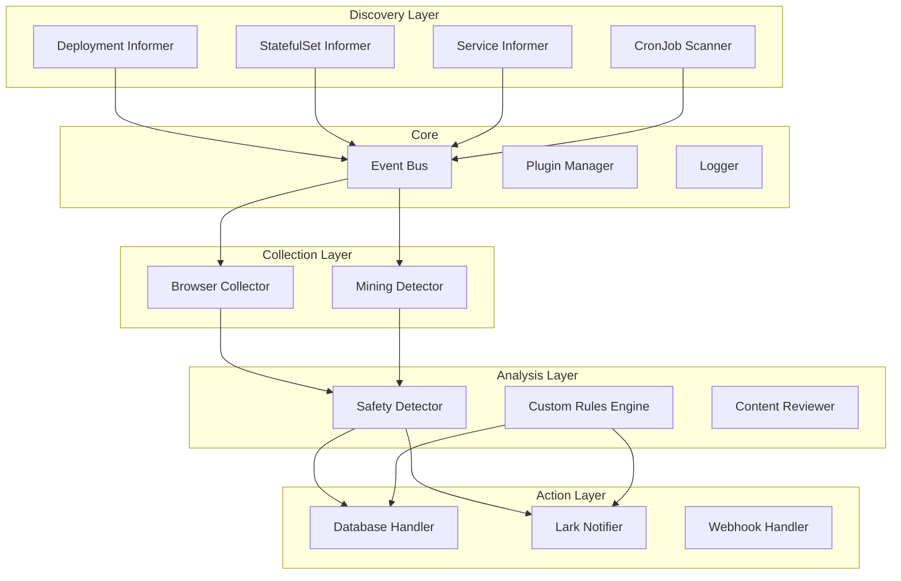

# CompliK - Kubernetes Compliance and Security Monitoring Platform

<div align="center">


[](https://go.dev)
[](https://kubernetes.io)
[](LICENSE)
[](docs/)

**CompliK** is a comprehensive Kubernetes-native compliance and security monitoring platform designed to automatically detect, analyze, and report security violations and compliance issues in cloud-native environments.

[Features](#-features) • [Quick Start](#-quick-start) • [Architecture](#-architecture) • [Documentation](#-documentation) • [Contributing](#-contributing)

</div>

---

## 🌟 Features

### 🔍 **Service Discovery**
- **Real-time Kubernetes Resource Monitoring**: Automatically discovers and tracks Deployments, StatefulSets, Services, and Endpoints
- **Multi-source Discovery**: Supports NodePort services, Ingress controllers, and custom resource definitions
- **Intelligent Change Detection**: Monitors resource changes and updates in real-time with configurable thresholds

### 🛡️ **Compliance & Security**
- **Content Safety Detection**: AI-powered content analysis for identifying illegal or inappropriate content
- **Custom Rule Engine**: Define and enforce custom compliance rules based on your organization's policies
- **Mining Process Detection**: Identifies and reports cryptocurrency mining processes in containers
- **Multi-level Security Scanning**: Browser-based content collection with screenshot evidence

### 🔔 **Alert & Notification**
- **Multi-channel Notifications**: Support for Lark (Feishu), Webhook, and custom notification channels
- **Intelligent Whitelisting**: Reduce false positives with smart whitelist management
- **Persistent Storage**: Database-backed alert history and audit trails

### 📊 **Observability**
- **Structured Logging**: Comprehensive logging with field-based context and multiple output formats
- **Performance Metrics**: Built-in performance tracking and resource utilization monitoring
- **Health Checks**: Automatic health monitoring and self-healing capabilities

## 🚀 Quick Start

### Prerequisites

- Kubernetes cluster (v1.20+)
- Go 1.19+ (for building from source)
- MySQL/PostgreSQL database (for persistence)
- AI API access (for content analysis)

### Installation

#### Using Docker

```bash
# Pull the latest image
docker pull bearslyricattack/complik:latest

# Run with custom configuration
docker run -d \
  --name complik \
  -v /path/to/config.yml:/app/config.yml \
  -v /path/to/kubeconfig:/app/kubeconfig \
  bearslyricattack/complik:latest
```

#### Using Kubernetes

```bash
# Clone the repository
git clone https://github.com/bearslyricattack/CompliK.git
cd CompliK

# Deploy using manifests
kubectl apply -f deploy/manifests/

# Or using Helm (coming soon)
helm install complik ./charts/complik
```

#### Build from Source

```bash
# Clone the repository
git clone https://github.com/bearslyricattack/CompliK.git
cd CompliK

# Build the binary
go build -o bin/complik cmd/complik/main.go

# Run with configuration
./bin/complik -config config.yml
```

### Configuration

Create a `config.yml` file based on the example:

```yaml
plugins:
  - name: "Complete"
    type: "Discovery"
    enabled: true
    settings: |
      {
        "intervalMinute": 10080,
        "autoStart": true,
        "startTimeSecond": 30
      }

  - name: "Browser"
    type: "Compliance"
    enabled: true
    settings: |
      {
        "timeout": 100,
        "maxWorkers": 20,
        "browserNumber": 20,
        "browserTimeout": 300
      }

  - name: "Safety"
    type: "Compliance"
    enabled: true
    settings: |
      {
        "apiKey": "${SAFETY_API_KEY}",
        "apiBase": "https://api.openai.com/v1",
        "model": "gpt-4"
      }

logging:
  level: "info"
  format: "json"
  output: "stdout"
  
kubeconfig: "${KUBECONFIG_PATH}"
```

### Environment Variables

CompliK supports environment variable substitution in configuration:

```bash
# Database Configuration
export DB_HOST=localhost
export DB_PORT=3306
export DB_USERNAME=complik
export DB_PASSWORD=secure_password

# AI Service Configuration
export SAFETY_API_KEY=your_api_key
export SAFETY_API_BASE=https://api.openai.com/v1

# Notification Configuration
export LARK_WEBHOOK=https://open.feishu.cn/open-apis/bot/v2/hook/xxx

# Kubernetes Configuration
export KUBECONFIG_PATH=/path/to/kubeconfig

# Logging Configuration
export LOG_LEVEL=info
export LOG_FORMAT=json
```

## 🏗️ Architecture

### System Architecture



### Plugin Architecture

CompliK uses a flexible plugin-based architecture that allows for easy extension and customization:

- **Discovery Plugins**: Monitor Kubernetes resources and emit discovery events
- **Collector Plugins**: Gather data from discovered resources
- **Detector Plugins**: Analyze collected data for compliance violations
- **Handler Plugins**: Take actions based on detection results

### Event-Driven Design

The system uses an event bus for loose coupling between components:

```go
// Discovery → Collection
DiscoveryTopic → CollectorTopic

// Collection → Detection  
CollectorTopic → DetectorTopic

// Detection → Handling
DetectorTopic → HandlerTopic
```

## 📦 Plugins

### Discovery Plugins

| Plugin | Description | Configuration |
|--------|-------------|---------------|
| `Complete` | Full cluster scanning | `intervalMinute`, `autoStart` |
| `Deployment` | Deployment monitoring | `resyncTimeSecond`, `ageThresholdSecond` |
| `StatefulSet` | StatefulSet monitoring | `resyncTimeSecond`, `ageThresholdSecond` |
| `NodePort` | NodePort service discovery | `resyncTimeSecond` |
| `EndpointSlice` | Endpoint monitoring | `resyncTimeSecond` |

### Compliance Plugins

| Plugin | Description | Configuration |
|--------|-------------|---------------|
| `Browser` | Web content collection | `timeout`, `maxWorkers`, `browserNumber` |
| `Safety` | AI-powered content analysis | `apiKey`, `apiBase`, `model` |
| `Custom` | Custom rule enforcement | `databaseName`, `tickerMinute` |
| `Mining` | Crypto mining detection | `intervalMinute`, `processNames` |

### Handler Plugins

| Plugin | Description | Configuration |
|--------|-------------|---------------|
| `Postgres` | PostgreSQL storage | `host`, `port`, `username`, `password` |
| `Lark` | Lark/Feishu notifications | `webhook`, `enabled_whitelist` |

## 📖 Documentation

### API Documentation

CompliK provides REST APIs for management and monitoring:

```bash
# Health check
GET /health

# Metrics
GET /metrics

# Plugin management
GET /api/v1/plugins
POST /api/v1/plugins/{name}/enable
POST /api/v1/plugins/{name}/disable

# Whitelist management
GET /api/v1/whitelist
POST /api/v1/whitelist
DELETE /api/v1/whitelist/{id}
```

### Configuration Reference

See [Configuration Guide](docs/configuration.md) for detailed configuration options.

### Plugin Development

To create custom plugins, implement the Plugin interface:

```go
type Plugin interface {
    Name() string
    Type() string
    Start(ctx context.Context, config PluginConfig, eventBus *EventBus) error
    Stop(ctx context.Context) error
}
```

See [Plugin Development Guide](docs/plugin-development.md) for more details.

## 🧪 Testing

```bash
# Run unit tests
go test ./...

# Run integration tests
go test -tags=integration ./...

# Run with coverage
go test -cover ./...

# Run specific test
go test -run TestPluginManager ./pkg/plugin
```

## 🔒 Security

### Security Features

- **Encrypted Configuration**: Support for encrypted passwords and API keys
- **RBAC Integration**: Kubernetes RBAC for resource access control
- **Secure Communication**: TLS support for all external communications
- **Audit Logging**: Comprehensive audit trail for all actions

### Reporting Security Issues

Please report security vulnerabilities to security@complik.io. Do not create public issues for security problems.

## 🤝 Contributing

We welcome contributions! Please see our [Contributing Guide](CONTRIBUTING.md) for details.

### Development Setup

```bash
# Install dependencies
go mod download

# Run locally
go run cmd/complik/main.go -config config.yml

# Format code
go fmt ./...

# Lint code
golangci-lint run

# Build binary
make build
```

### Code Style

- Follow [Effective Go](https://golang.org/doc/effective_go.html)
- Use structured logging with appropriate levels
- Add unit tests for new features
- Update documentation for API changes

## 📄 License

CompliK is licensed under the Apache License 2.0. See [LICENSE](LICENSE) file for details.

## 🙏 Acknowledgments

- Kubernetes community for the excellent client-go library
- OpenAI for GPT models used in content analysis
- Rod library for browser automation
- All contributors and users of CompliK

<div align="center">

**Built with ❤️ by the CompliK Team**

</div>