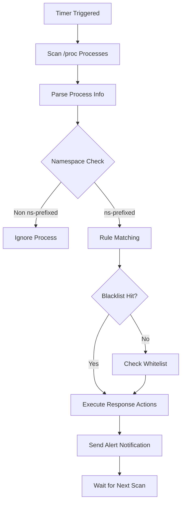

# 🛡️ ProcScan - Kubernetes Security Scanner

[](https://golang.org/)
[](LICENSE)
[]()

> A lightweight security scanning tool designed specifically for Kubernetes, focused on process monitoring and threat detection.

---

## 🎯 Overview

ProcScan is a streamlined node security tool that runs as a `DaemonSet` on every node in a Kubernetes cluster, continuously scanning for suspicious processes and executing automated responses based on a flexible rule engine.

### ✨ Key Features

- 🔍 **Process Scanning**: Real-time process monitoring based on `/proc` filesystem
- 🎯 **Intelligent Detection**: Blacklist and whitelist rule matching
- 📢 **Alert Notifications**: Lark (Feishu) Webhook notification integration
- 🏷️ **Automated Response**: Label-based automated processing
- ☸️ **Native Integration**: Fully compatible with Kubernetes ecosystem
- 📝 **Lightweight Configuration**: Simplified configuration file, easy to deploy and maintain

---

## 🚀 Quick Start

### Prerequisites

- Kubernetes 1.19+
- Go 1.24+ (development environment only)

### 1. Deploy to Kubernetes

```bash
# Clone repository
git clone https://github.com/bearslyricattack/procscan.git
cd procscan

# Create namespace
kubectl create namespace procscan

# Deploy configuration
kubectl create configmap procscan-config --from-file=config.simple.yaml -n procscan

# Deploy application
kubectl apply -f deploy/ -n procscan

# Check running status
kubectl get pods -n procscan -o wide
```

### 2. Run Locally

```bash
# Clone repository
git clone https://github.com/bearslyricattack/procscan.git
cd procscan

# Install dependencies
go mod download

# Run application
go run cmd/procscan/main.go -config config.simple.yaml
```

---

## ⚙️ Configuration

### Core Configuration File

Configure using `config.simple.yaml`:

```yaml
# Scanner configuration
scanner:
  proc_path: "/host/proc"      # Process filesystem path
  scan_interval: "30s"         # Scan interval
  log_level: "info"            # Log level
  max_workers: 2               # Concurrent scan count

# Automated response
actions:
  label:
    enabled: true              # Enable label annotation
    data:
      security.status: "suspicious"
      scanner.detected: "true"

# Detection rules
detectionRules:
  blacklist:
    processes:                 # Blacklist processes
      - "^miner$"
      - "^xmrig$"
      - "^crypto$"
    keywords:                  # Blacklist keywords
      - "stratum+tcp"
      - "pool."
      - "monero"

  whitelist:
    processes:                 # Whitelist processes
      - "^sh$"
      - "^bash$"
      - "^python[0-9]*$"
    namespaces:                # Whitelist namespaces
      - "kube-system"
      - "procscan"

# Alert notifications
notifications:
  lark:
    webhook: ""                # Lark Webhook URL
    timeout: "30s"
    retry_count: 3
```

### Detection Rules

#### Blacklist Rules
- **Process Name Matching**: Use regular expressions to match process names
- **Keyword Matching**: Match suspicious keywords in command lines
- **Supported Patterns**: `^miner$`, `^xmrig$`, `stratum+tcp`, etc.

#### Whitelist Rules
- **System Processes**: `sh`, `bash`, `python`, `java`, `node`, etc.
- **System Namespaces**: `kube-system`, `procscan`, etc.
- **Avoid False Positives**: Protect normal system processes and services

---

## 📊 How It Works

### Scanning Workflow



### Response Mechanism

1. **Label Annotation**: Add security labels to suspicious Pods
2. **Alert Notification**: Send alert messages via Lark
3. **Logging**: Detailed logging of detection process and results

---

## 🔧 Deployment Configuration

### DaemonSet Configuration

```yaml
apiVersion: apps/v1
kind: DaemonSet
metadata:
  name: procscan
  namespace: procscan
spec:
  template:
    spec:
      containers:
      - name: procscan
        image: procscan:latest
        volumeMounts:
        - name: proc-path
          mountPath: /host/proc
          readOnly: true
      volumes:
      - name: proc-path
        hostPath:
          path: /proc
      tolerations:
      - key: "node-role.kubernetes.io/master"
        operator: "Exists"
        effect: "NoSchedule"
```

### RBAC Permissions

```yaml
apiVersion: rbac.authorization.k8s.io/v1
kind: ClusterRole
metadata:
  name: procscan
rules:
- apiGroups: [""]
  resources: ["pods"]
  verbs: ["get", "list", "watch", "update", "patch"]
- apiGroups: [""]
  resources: ["namespaces"]
  verbs: ["get", "list", "update", "patch"]
```

---

## 📝 Usage Examples

### Basic Monitoring

```bash
# View running logs
kubectl logs -n procscan -l app=procscan -f

# Check Pod status
kubectl get pods -n procscan -o wide

# View detected threats
kubectl get pods -l security.status=suspicious --all-namespaces
```

### Alert Configuration

Configure Lark Webhook:

```bash
# Edit ConfigMap
kubectl edit configmap procscan-config -n procscan

# Add Webhook URL
notifications:
  lark:
    webhook: "https://open.feishu.cn/open-apis/bot/v2/hook/your-webhook"
```

---

## 🛠️ Development Guide

### Building the Project

```bash
# Local build
go build -o procscan cmd/procscan/main.go

# Cross-compilation
GOOS=linux GOARCH=amd64 go build -o procscan-linux-amd64 cmd/procscan/main.go
```

### Project Structure

```
procscan/
├── cmd/procscan/          # Application entry point
├── internal/              # Core business logic
│   ├── scanner/          # Scanning engine
│   ├── container/        # Container management
│   └── notification/     # Notification system
├── pkg/                   # Common components
│   ├── config/           # Configuration management
│   ├── k8s/              # Kubernetes client
│   ├── logger/           # Logging component
│   └── models/           # Data models
├── deploy/               # Deployment manifests
├── config.simple.yaml    # Simplified configuration file
└── README.md
```

---

## 🚨 Troubleshooting

### Common Issues

1. **Insufficient Permissions**
   ```bash
   # Check RBAC permissions
   kubectl auth can-i get pods --as=system:serviceaccount:procscan:procscan
   ```

2. **Configuration File Error**
   ```bash
   # Verify configuration file
   kubectl get configmap procscan-config -n procscan -o yaml
   ```

3. **Container Runtime Connection Failed**
   ```bash
   # Check /proc mount
   kubectl exec -n procscan <pod> -- ls -la /host/proc
   ```

### Log Analysis

```bash
# View detailed logs
kubectl logs -n procscan <pod> --tail=100

# Search for error messages
kubectl logs -n procscan -l app=procscan | grep -i error
```

---

## 📄 License

This project is licensed under the Apache License 2.0. See the [LICENSE](LICENSE) file for details.

---

## 🤝 Contributing

Issues and Pull Requests are welcome!

1. Fork this repository
2. Create your feature branch (`git checkout -b feature/AmazingFeature`)
3. Commit your changes (`git commit -m 'Add some AmazingFeature'`)
4. Push to the branch (`git push origin feature/AmazingFeature`)
5. Open a Pull Request

---

> **Project Maintainer**: ProcScan Team
> **Last Updated**: 2025-10-21
> **Version**: v1.0.0-alpha
