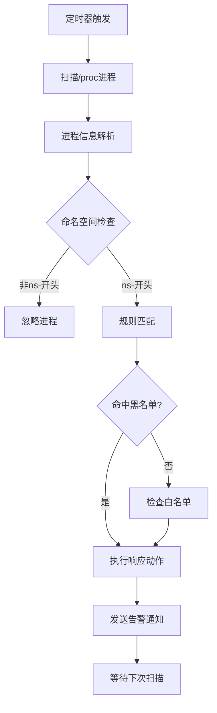

# 🛡️ ProcScan - Kubernetes 安全扫描工具

[](https://golang.org/)
[](LICENSE)
[]()

> 一个专为 Kubernetes 设计的轻量级安全扫描工具，专注于进程监控和威胁检测。

---

## 🎯 项目概述

ProcScan 是一个精简的节点安全工具，以 `DaemonSet` 的形式运行在 Kubernetes 集群的每个节点上，持续扫描可疑进程，并基于灵活的规则引擎执行自动化响应。

### ✨ 核心特性

- 🔍 **进程扫描**: 基于 `/proc` 文件系统的实时进程监控
- 🎯 **智能检测**: 黑名单和白名单规则匹配
- 📢 **告警通知**: 飞书 Webhook 通知集成
- 🏷️ **自动响应**: 基于标签的自动化处理
- ☸️ **原生集成**: 完全适配 Kubernetes 生态
- 📝 **轻量配置**: 简化的配置文件，易于部署和维护

---

## 🚀 快速开始

### 前置要求

- Kubernetes 1.19+
- Go 1.24+ (仅开发环境需要)

### 1. 部署到 Kubernetes

```bash
# 克隆仓库
git clone https://github.com/bearslyricattack/procscan.git
cd procscan

# 创建命名空间
kubectl create namespace procscan

# 部署配置
kubectl create configmap procscan-config --from-file=config.simple.yaml -n procscan

# 部署应用
kubectl apply -f deploy/ -n procscan

# 查看运行状态
kubectl get pods -n procscan -o wide
```

### 2. 本地运行

```bash
# 克隆仓库
git clone https://github.com/bearslyricattack/procscan.git
cd procscan

# 安装依赖
go mod download

# 运行程序
go run cmd/procscan/main.go -config config.simple.yaml
```

---

## ⚙️ 配置说明

### 核心配置文件

使用 `config.simple.yaml` 进行配置：

```yaml
# 扫描器配置
scanner:
  proc_path: "/host/proc"      # 进程文件系统路径
  scan_interval: "30s"         # 扫描间隔
  log_level: "info"            # 日志级别
  max_workers: 2               # 并发扫描数

# 自动化响应
actions:
  label:
    enabled: true              # 启用标签标注
    data:
      security.status: "suspicious"
      scanner.detected: "true"

# 检测规则
detectionRules:
  blacklist:
    processes:                 # 黑名单进程
      - "^miner$"
      - "^xmrig$"
      - "^crypto$"
    keywords:                  # 黑名单关键词
      - "stratum+tcp"
      - "pool."
      - "monero"

  whitelist:
    processes:                 # 白名单进程
      - "^sh$"
      - "^bash$"
      - "^python[0-9]*$"
    namespaces:                # 白名单命名空间
      - "kube-system"
      - "procscan"

# 告警通知
notifications:
  lark:
    webhook: ""                # 飞书 Webhook URL
    timeout: "30s"
    retry_count: 3
```

### 检测规则说明

#### 黑名单规则
- **进程名匹配**: 使用正则表达式匹配进程名
- **关键词匹配**: 匹配命令行中的可疑关键词
- **支持模式**: `^miner$`, `^xmrig$`, `stratum+tcp` 等

#### 白名单规则
- **系统进程**: `sh`, `bash`, `python`, `java`, `node` 等
- **系统命名空间**: `kube-system`, `procscan` 等
- **避免误报**: 保护正常的系统进程和服务

---

## 📊 工作原理

### 扫描流程



### 响应机制

1. **标签标注**: 为可疑 Pod 添加安全标签
2. **告警通知**: 通过飞书发送告警消息
3. **日志记录**: 详细记录检测过程和结果

---

## 🔧 部署配置

### DaemonSet 配置

```yaml
apiVersion: apps/v1
kind: DaemonSet
metadata:
  name: procscan
  namespace: procscan
spec:
  template:
    spec:
      containers:
      - name: procscan
        image: procscan:latest
        volumeMounts:
        - name: proc-path
          mountPath: /host/proc
          readOnly: true
      volumes:
      - name: proc-path
        hostPath:
          path: /proc
      tolerations:
      - key: "node-role.kubernetes.io/master"
        operator: "Exists"
        effect: "NoSchedule"
```

### RBAC 权限

```yaml
apiVersion: rbac.authorization.k8s.io/v1
kind: ClusterRole
metadata:
  name: procscan
rules:
- apiGroups: [""]
  resources: ["pods"]
  verbs: ["get", "list", "watch", "update", "patch"]
- apiGroups: [""]
  resources: ["namespaces"]
  verbs: ["get", "list", "update", "patch"]
```

---

## 📝 使用示例

### 基础监控

```bash
# 查看运行日志
kubectl logs -n procscan -l app=procscan -f

# 检查 Pod 状态
kubectl get pods -n procscan -o wide

# 查看检测到的威胁
kubectl get pods -l security.status=suspicious --all-namespaces
```

### 告警配置

配置飞书 Webhook：

```bash
# 编辑 ConfigMap
kubectl edit configmap procscan-config -n procscan

# 添加 Webhook URL
notifications:
  lark:
    webhook: "https://open.feishu.cn/open-apis/bot/v2/hook/your-webhook"
```

---

## 🛠️ 开发指南

### 构建项目

```bash
# 本地构建
go build -o procscan cmd/procscan/main.go

# 交叉编译
GOOS=linux GOARCH=amd64 go build -o procscan-linux-amd64 cmd/procscan/main.go
```

### 项目结构

```
procscan/
├── cmd/procscan/          # 应用入口
├── internal/              # 核心业务逻辑
│   ├── scanner/          # 扫描引擎
│   ├── container/        # 容器管理
│   └── notification/     # 通知系统
├── pkg/                   # 公共组件
│   ├── config/           # 配置管理
│   ├── k8s/              # Kubernetes 客户端
│   ├── logger/           # 日志组件
│   └── models/           # 数据模型
├── deploy/               # 部署清单
├── config.simple.yaml    # 简化配置文件
└── README.md
```

---

## 🚨 故障排除

### 常见问题

1. **权限不足**
   ```bash
   # 检查 RBAC 权限
   kubectl auth can-i get pods --as=system:serviceaccount:procscan:procscan
   ```

2. **配置文件错误**
   ```bash
   # 验证配置文件
   kubectl get configmap procscan-config -n procscan -o yaml
   ```

3. **容器运行时连接失败**
   ```bash
   # 检查 /proc 挂载
   kubectl exec -n procscan <pod> -- ls -la /host/proc
   ```

### 日志分析

```bash
# 查看详细日志
kubectl logs -n procscan <pod> --tail=100

# 搜索错误信息
kubectl logs -n procscan -l app=procscan | grep -i error
```

---

## 📄 许可证

本项目采用 Apache License 2.0 许可证。详见 [LICENSE](LICENSE) 文件。

---

## 🤝 贡献

欢迎提交 Issue 和 Pull Request！

1. Fork 本仓库
2. 创建特性分支 (`git checkout -b feature/AmazingFeature`)
3. 提交更改 (`git commit -m 'Add some AmazingFeature'`)
4. 推送到分支 (`git push origin feature/AmazingFeature`)
5. 开启 Pull Request

---

> **项目维护**: ProcScan Team
> **最后更新**: 2025-10-21
> **版本**: v1.0.0-alpha