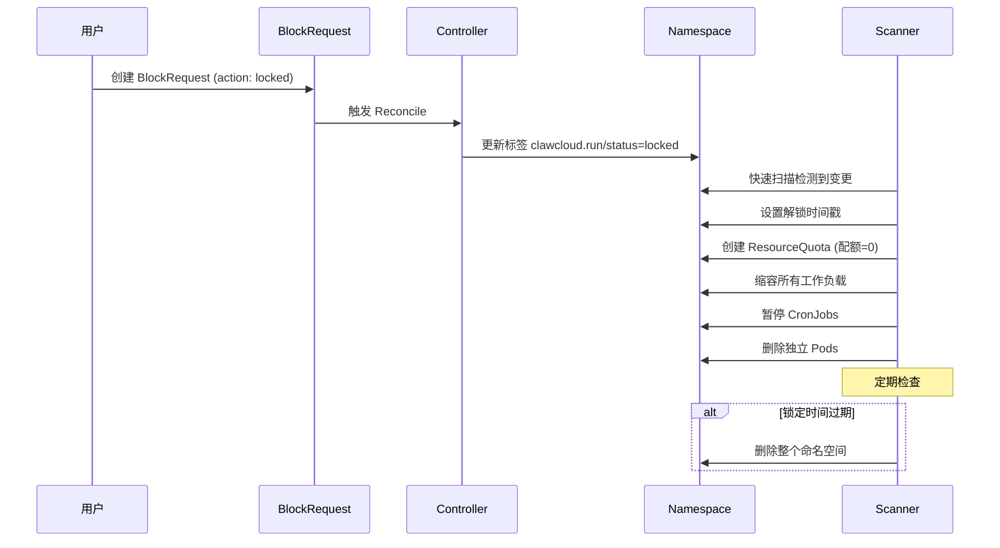
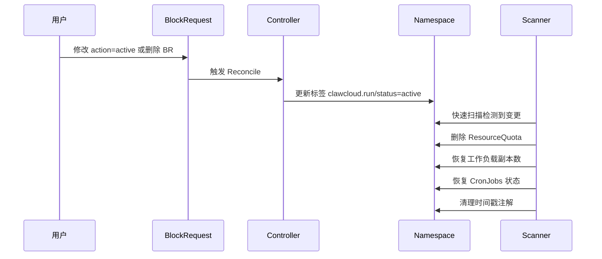

# Block Controller 项目功能详细分析

## 项目概述
`block-controller` 是一个 Kubernetes 控制器，实现了**命名空间生命周期管理**和**资源封禁机制**。它通过标签和自定义资源来控制命名空间的使用权限，非常适合临时环境、用户试用、资源配额管理等 PaaS 平台场景。

## 核心功能组件

### 1. 自定义资源定义 (CRD) - BlockRequest
**文件**: `api/v1/blockrequest_types.go`, `config/crd/bases/core.clawcloud.run_blockrequests.yaml`

- **功能**: 提供声明式的 API 来批量管理命名空间状态
- **支持两种目标选择方式**:
  - `namespaceNames`: 直接指定命名空间名称列表
  - `namespaceSelector`: 通过标签选择器批量选择命名空间
- **支持两种操作**:
  - `action: "locked"`: 封禁命名空间
  - `action: "active"`: 解封命名空间
- **状态跟踪**: 记录每个命名空间的处理状态和进度，支持分页处理大量命名空间

#### BlockRequest 资源示例
```yaml
apiVersion: core.clawcloud.run/v1
kind: BlockRequest
metadata:
  name: blockrequest-sample
spec:
  namespaceNames:
  - default
  - ns-test
  action: "locked"
```

### 2. 控制器逻辑 - BlockRequestReconciler
**文件**: `internal/controller/blockrequest_controller.go`

- **核心职责**: 处理 BlockRequest 资源的变更
- **批量处理**: 支持分批处理大量命名空间 (batch size=100)
- **最终一致性**: 通过 finalizer 确保资源清理
- **冲突处理**: 智能处理并发修改冲突
- **状态管理**: 实时更新处理进度和结果

#### 控制器处理流程
1. **接收 BlockRequest 变更事件**
2. **添加 Finalizer** (确保资源清理)
3. **分阶段处理目标命名空间**:
   - Phase 1: 处理 `namespaceNames` 列表
   - Phase 2: 处理 `namespaceSelector` 匹配的命名空间 (支持分页)
4. **更新命名空间标签** (`clawcloud.run/status`)
5. **记录处理状态** 到 BlockRequest status
6. **处理删除事件** (清理 finalizer)

### 3. 命名空间扫描器 - NamespaceScanner
**文件**: `internal/scanner/namespace_scanner.go`

#### 双扫描机制
- **快速扫描** (Fast Scan, 默认1分钟间隔):
  - 只扫描带有 `clawcloud.run/status` 标签的命名空间
  - 快速响应状态变更
  - 高效处理活跃变更
- **慢速扫描** (Slow Scan, 默认1小时间隔):
  - 全量扫描所有命名空间 (分页处理)
  - 作为"看门狗"确保一致性
  - 处理遗漏的状态变更

#### 封禁操作 (handleLock)
当检测到命名空间状态为 `locked` 时:

1. **设置解锁时间戳**:
   - 在 annotation 中添加 `clawcloud.run/unlock-timestamp`
   - 默认解锁时间为当前时间 + lockDuration (7天)

2. **创建限制性 ResourceQuota**:
   ```yaml
   # 所有资源配额都设为 0
   resources:
     pods: 0
     services: 0
     requests.cpu: 0
     requests.memory: 0
     # ... 其他资源
   ```

3. **缩容所有工作负载到0副本**:
   - **Deployments**: 保存原始副本数，设置 replicas=0
   - **StatefulSets**: 保存原始副本数，设置 replicas=0
   - **ReplicaSets**: 保存原始副本数，设置 replicas=0
   - **ReplicationControllers**: 保存原始副本数，设置 replicas=0
   - **CronJobs**: 保存原始暂停状态，设置 suspend=true

4. **清理独立 Pods**:
   - 删除没有 owner reference 的独立 Pods
   - 保留由工作负载管理的 Pods (会随工作负载缩容而清理)

#### 解封操作 (handleUnlock)
当检测到命名空间状态为 `active` 时:

1. **删除 ResourceQuota**: 移除所有资源限制
2. **恢复工作负载副本数**:
   - 从 annotation 中读取原始副本数
   - 恢复 Deployments, StatefulSets, ReplicaSets, ReplicationControllers
   - 清理相关 annotation
3. **恢复 CronJobs**: 恢复原始暂停状态
4. **清理时间戳注解**: 删除 `clawcloud.run/unlock-timestamp`

#### 过期处理 (handleLockExpiration)
- **定时检查**: 每次扫描时检查解锁时间戳
- **自动删除**: 如果当前时间超过解锁时间且状态仍为 `locked`
- **强制清理**: 删除整个命名空间，释放所有资源

### 4. 标签和注解系统
**文件**: `internal/constants/constants.go`

#### 核心标签
- `clawcloud.run/status`: 命名空间状态
  - `"locked"`: 封禁状态
  - `"active"`: 活跃状态

#### 核心注解
- `clawcloud.run/unlock-timestamp`: RFC3339格式的解锁时间
- `core.clawcloud.run/original-replicas`: 原始副本数 (字符串格式)
- `core.clawcloud.run/original-suspend`: 原始CronJob暂停状态

#### Finalizer
- `core.clawcloud.run/finalizer`: 确保资源正确清理

### 5. 资源配额管理
**文件**: `internal/utils/resourcequota.go`

#### 全面的资源限制
```go
resources := v1.ResourceList{
    "pods":                   resource.MustParse("0"),
    "services":               resource.MustParse("0"),
    "replicationcontrollers": resource.MustParse("0"),
    "secrets":                resource.MustParse("0"),
    "configmaps":             resource.MustParse("0"),
    "persistentvolumeclaims": resource.MustParse("0"),
    "services.nodeports":     resource.MustParse("0"),
    "services.loadbalancers": resource.MustParse("0"),
    "requests.cpu":           resource.MustParse("0"),
    "requests.memory":        resource.MustParse("0"),
    "limits.cpu":             resource.MustParse("0"),
    "limits.memory":          resource.MustParse("0"),
}
```

#### 零配额策略
- **完全阻止**: 所有资源限制为0，阻止新资源创建
- **存储选项**: 可选的存储请求限制 (`requests.storage: 0`)
- **ResourceQuota 名称**: `block-controller-quota`

### 6. 运行时配置
**文件**: `cmd/main.go`

#### 可配置参数
```bash
# 核心功能配置
--lock-duration=168h           # 封禁持续时间 (默认7天)
--fast-scan-interval=1m       # 快速扫描间隔 (默认1分钟)
--slow-scan-interval=1h       # 慢速扫描间隔 (默认1小时)
--scan-batch-size=100          # 扫描批次大小 (默认100)
--max-concurrent-reconciles=1  # 最大并发协调数 (默认1)

# 服务配置
--metrics-bind-address=:8443   # 指标服务地址
--health-probe-bind-address=:8081  # 健康检查地址
--leader-elect=false          # 领导选举 (默认关闭)
--web-hook-enable=true        # 启用Webhook服务器 (默认true)

# TLS 配置
--webhook-cert-path=""         # Webhook证书路径
--metrics-secure=true         # 指标服务HTTPS (默认true)
```

#### 架构组件
1. **Manager**: controller-runtime 管理器
2. **BlockRequest Controller**: 处理 CRD 变更
3. **Namespace Scanner**: 独立的扫描器服务
4. **Metrics Server**: Prometheus 指标
5. **Health Probes**: 健康检查端点
6. **Webhook Server**: 准入控制 (可选)

### 7. 部署和构建
**文件**: `Makefile`, `config/` 目录

#### 构建功能
- **Docker 镜像构建**: 支持多平台 (linux/amd64, linux/arm64)
- **跨平台编译**: buildx 支持 (linux/arm64,linux/amd64,linux/s390x,linux/ppc64le)
- **代码质量**: golangci-lint 静态分析
- **测试支持**:
  - 单元测试 (ENVTEST)
  - E2E 测试 (Kind 集群)
- **代码生成**: deepcopy, CRD, RBAC 自动生成

#### 部署配置
- **Kustomize**: YAML 配置管理
- **RBAC**: 最小权限原则
- **命名空间**: 默认部署到 `block-controller-system`
- **监控**: Prometheus 指标集成
- **网络策略**: 流量控制 (可选)

#### 部署清单结构
```
config/
├── crd/              # CRD 定义
├── rbac/             # RBAC 权限
├── manager/          # 控制器部署配置
├── default/          # 默认配置 (kustomization)
├── prometheus/       # 监控配置
├── network-policy/   # 网络策略
└── samples/          # 示例资源
```

## 使用场景

### 1. 临时环境管理
- **开发环境**: 自动清理过期的开发命名空间
- **测试环境**: 定期封禁测试环境，避免资源浪费
- **CI/CD**: 临时构建环境的生命周期管理

### 2. 多租户 PaaS 平台
- **用户隔离**: 控制用户只能访问自己的命名空间
- **资源限制**: 防止用户创建过多资源
- **计费周期**: 基于时间的资源使用计费

### 3. 资源配额管理
- **防滥用**: 限制恶意或异常的资源创建
- **容量规划**: 在资源紧张时临时封禁非关键服务
- **成本控制**: 自动清理不活跃的资源

### 4. 安全合规
- **定期清理**: 满足数据保留策略要求
- **访问控制**: 基于时间的访问权限管理
- **审计要求**: 自动化的资源生命周期记录

## 工作流程示例

### 封禁流程


### 解封流程


## 项目优势

### 1. Kubernetes 原生设计
- **声明式 API**: 符合 Kubernetes 设计理念
- **控制器模式**: 标准 Kubernetes 控制器架构
- **资源友好**: 遵循 Kubernetes 最佳实践

### 2. 高可用性
- **领导选举**: 支持多实例部署
- **错误恢复**: 智能处理冲突和重试
- **最终一致性**: 保证系统状态最终正确

### 3. 可扩展性
- **批量处理**: 支持大规模命名空间管理
- **配置灵活**: 丰富的运行时参数
- **模块化设计**: 清晰的组件分离

### 4. 生产就绪
- **监控集成**: Prometheus 指标支持
- **健康检查**: 完整的探针支持
- **安全配置**: TLS 和 RBAC 支持

## 技术栈

- **语言**: Go 1.24.5
- **框架**: controller-runtime v0.22.1
- **Kubernetes**: v0.34.0
- **构建**: Docker, Makefile
- **测试**: Ginkgo/Gomega, ENVTEST
- **代码质量**: golangci-lint
- **部署**: Kustomize

## 文件结构概览

```
block-controller/
├── api/v1/                    # API 定义
│   ├── blockrequest_types.go  # BlockRequest 类型定义
│   └── zz_generated.deepcopy.go # 自动生成的 deepcopy 方法
├── cmd/main.go               # 主程序入口
├── internal/
│   ├── constants/            # 常量定义
│   ├── controller/           # BlockRequest 控制器
│   ├── scanner/              # 命名空间扫描器
│   └── utils/                # 工具函数
├── config/                   # 部署配置
├── deploy/                   # 部署清单
├── example/                  # 使用示例
├── hack/                     # 构建脚本
├── Makefile                  # 构建配置
└── README.md                 # 项目文档
```

这个项目是一个设计完整、功能丰富的 Kubernetes 原生控制器，具有生产环境所需的所有特性：高可用、可监控、可配置、可扩展。非常适合作为 PaaS 平台的底层组件来管理命名空间和资源的生命周期。